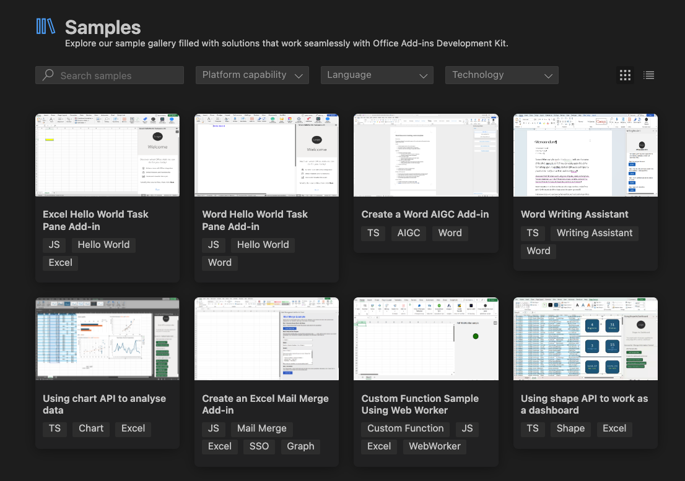

# How to add samples to sample gallery of Office Add-ins Development Kit

Sample gallery is one of the key features in [Office Add-ins Development Kit](https://marketplace.visualstudio.com/items?itemName=msoffice.microsoft-office-add-in-debugger).

## Branch

For new samples, please use `dev` as the target branch for pull requests. The `dev` branch will be merged into `main` after testing.

`main` branch is the release branch. All content `main` appears in the [Office Add-ins Development Kit](https://marketplace.visualstudio.com/items?itemName=msoffice.microsoft-office-add-in-debugger)'s sample gallery.

## Testing

TBD

## Check in new sample into Sample Gallery

1. Add the sample project folder is under the **Samples** directory.
    1. Make sure it has `launch.json` file in`.vscode` folder and at least one launch config in it. Press `F5` to launch is a key experience of Dev Kit. When user press `F5` in an opening sample project, the first profile in `.vscode/launch.json` will be executed to launch the sample. Node and webpack is also needed if you want start a dev host of add-in locally and attach debugger.
        * Refer [this sample](./Samples/excel-get-started-with-dev-kit/) as an example.
    2. Make sure it runs and has been tested on the supported platforms.
    3. Add the **README.md** and **RUN_WITH_EXTENSION.md** files. Use the **README_TEMPLATE.md** under the root directory as a base.
2. Add a new config to the [config file](./.config/sample-config.json) with following format.
    * Make sure **id** has identical value with the folder name you just created.

## JSON config of sample gallery

### Configure the sample for the Dev Kit

The Dev Kit sample gallery uses the [samples-config.json](./.config/sample-config.json) file in this repo's `main` branch. It uses the sample configuration ID find the files, downloads a .zip file of the sample project from this repo, and unzips that file in the designated path.

### JSON properties

* `filterOptions`: defines the options of the filter bar at the top of sample gallery
    * `capabilities`: platforms that samples in this sample gallery support, it's supposed to be a subset of the host apps of Office like ["Word", "Excel", "PowerPoint", "Outlook"]
    * `language`: the programming language of samples
    * `technologies`: technologies used in samples like "SSO", "Graph", "Azure"
* `samples`: this property should be a list of sample configs in sample gallery.
    * `id`: the configuration id and the folder name under Samples folder
    * `onboardDate`: when this sample onboard sample gallery
    * `title`: title of the sample add-in, will show in the sample card of sample gallery
    * `description`: a description of the sample id, will used for sample matching when users search samples in sample gallery
    * `types`: the platform type this sample supports, should be a subset of `capabilities` of `filterOptions`
    * `tags`: tags of this sample, will show in the sample card of the sample gallery below title. You can set the tags referring the values in filterOptions
    * `thumbnailPath`: the image (.png/.img) that shows in the sample card. Use relative path to the sample folder
    * `suggested`: if this sample is suggested, default value is `false`. if set `true`, the suggested samples will be presented like showcases at the top of sample gallery above all other samples.

