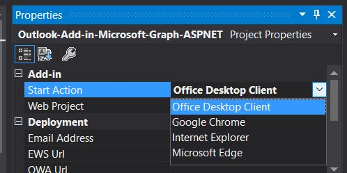
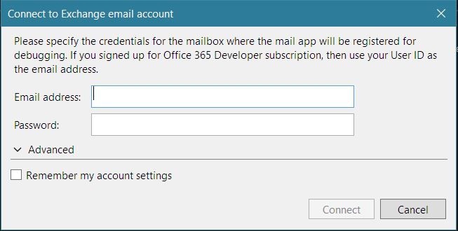

# Get Excel workbooks using Microsoft Graph and MSAL in an Outlook Add-in

Learn how to build a Microsoft Outlook Add-in that connects to Microsoft Graph, finds the first three workbooks stored in OneDrive for Business, fetches their filenames, and inserts the names into a new message compose form in Outlook.

## Features

Integrating data from online service providers increases the value and adoption of your add-ins. This code sample shows you how to connect your Outlook add-in to Microsoft Graph. Use this code sample to:

* Connect to Microsoft Graph from an Office Add-in.
* Use the MSAL.NET Library to implement the OAuth 2.0 authorization framework in an add-in.
* Use the OneDrive REST APIs from Microsoft Graph.
* Show a dialog using the Office UI namespace.
* Build an Add-in using ASP.NET MVC, MSAL 3.x.x for .NET,  and Office.js.

## Applies to

* Outlook on all platforms

## Prerequisites

To run this code sample, the following are required.

* Visual Studio 2019 or later.

* SQL Server Express (If it is not automatically installed with recent versions of Visual Studio.)

* A Microsoft 365 account. You can get one if you qualify for a Microsoft 365 E5 developer subscription through the [Microsoft 365 Developer Program](https://aka.ms/m365devprogram); for details, see the [FAQ](https://learn.microsoft.com/office/developer-program/microsoft-365-developer-program-faq#who-qualifies-for-a-microsoft-365-e5-developer-subscription-). Alternatively, you can [sign up for a 1-month free trial](https://www.microsoft.com/microsoft-365/try) or [purchase a Microsoft 365 plan](https://www.microsoft.com/microsoft-365/business/compare-all-microsoft-365-business-products-g).

* At least three Excel workbooks stored on OneDrive for Business in your Office 365 subscription.

* Optional, if you want to debug on the desktop instead of Outlook Online: Outlook for Windows, version 1809 or higher.
* [Office Developer Tools](https://www.visualstudio.com/en-us/features/office-tools-vs.aspx)

* A Microsoft Azure Tenant. This add-in requires Azure Active Directiory (AD). Azure AD provides identity services that applications use for authentication and authorization. A trial subscription can be acquired here: [Microsoft Azure](https://account.windowsazure.com/SignUp).

## Solution

Solution | Author(s)
---------|----------
Outlook Add-in Microsoft Graph ASP.NET | Microsoft

## Version history

Version  | Date | Comments
---------| -----| --------
1.0  | July 8th, 2019| Initial release

## Disclaimer

**THIS CODE IS PROVIDED *AS IS* WITHOUT WARRANTY OF ANY KIND, EITHER EXPRESS OR IMPLIED, INCLUDING ANY IMPLIED WARRANTIES OF FITNESS FOR A PARTICULAR PURPOSE, MERCHANTABILITY, OR NON-INFRINGEMENT.**

----------

## Build and run the solution

## Configure the solution

1. In **Visual Studio**, choose the **Outlook-Add-in-Microsoft-Graph-ASPNETWeb** project. In **Properties**, ensure **SSL Enabled** is **True**. Verify that the **SSL URL** uses the same domain name and port number as those listed in the next step.

1. Register your application using the [Azure Management Portal](https://manage.windowsazure.com). **Log in with the identity of an administrator of your Office 365 tenancy to ensure that you are working in an Azure Active Directory that is associated with that tenancy.** To learn how to register your application, see [Register an application with the Microsoft Identity Platform](https://learn.microsoft.com/graph/auth-register-app-v2). Use the following settings:

    * REDIRECT URI: https://localhost:44301/AzureADAuth/Authorize
    * SUPPORTED ACCOUNT TYPES: "Accounts in this organizational directory only"
    * IMPLICIT GRANT: Do not enable any Implicit Grant options
    * API PERMISSIONS (Delegated permissions, not Application permissions): **Files.Read.All** and **User.Read**

    > Note: After you register your application, copy the **Application (client) ID** and the **Directory (tenant) ID** on the **Overview** blade of the App Registration in the Azure Management Portal. When you create the client secret on the **Certificates & secrets** blade, copy it too.

1. In web.config, use the values that you copied in the previous step. Set **AAD:ClientID** to your client id, set **AAD:ClientSecret** to your client secret, and set **"AAD:O365TenantID"** to your tenant ID.

## Run the solution

1. Open the Visual Studio solution file.
1. Select and hold (or right-click) **Outlook-Add-in-Microsoft-Graph-ASPNET** solution in **Solution Explorer** (not the project nodes), and then choose **Set startup projects**. Select the **Multiple startup projects** radio button. Make sure the project that ends with "Web" is listed first.
1. On the **Build** menu, select **Clean Solution**. When it finishes, open the **Build** menu again and select **Build Solution**.
1. In **Solution Explorer**, select the **Outlook-Add-in-Microsoft-Graph-ASPNET** project node (not the top solution node and not the project whose name ends in "Web").
1. In the **Properties** pane, open the **Start Action** drop down and choose whether to run the add-in in desktop Outlook or with Outlook on the web in one of the listed browsers. (*Do not choose Internet Explorer. See **Known Issues** below for why.*)

    

1. Press F5. The first time you do this, you will be prompted to specify the email and password of the user that you will use for debugging the add-in. Use the credentials of an admin for your O365 tenancy.

    

    >NOTE: The browser will open to the login page for Office on the web. (So, if this is the first time you have run the add-in, you will enter the username and password twice.) 

The remaining steps depend on whether you are running the add-in in desktop Outlook or Outlook on the web.

### Run the solution with Outlook on the web

1. Outlook for Web will open in a browser window. In Outlook, click **New** to create a new email message. 
1. Below the compose form is a tool bar with buttons for **Send**, **Discard**, and other utilities. Depending on which **Outlook on the web** experience you are using, the icon for the add-in is either near the far right end of this tool bar or it is on the drop down down menu that opens when you click the **...** button on this tool bar.

   

1. Click the icon to open the task pane add-in.
1. Use the add-in to add the names of the first three workbooks in the user's OneDrive account to the message. The pages and buttons of the add-in are self-explanatory.

## Run the project with desktop Outlook

1. Desktop Outlook will open. In Outlook, click **New Email** to create a new email message. 
1. On the **Message** ribbon of the **Message** form, there is a button labelled **Open Add-in** in a group called **OneDrive Files**. Click the button to open the add-in.
1. Use the add-in to add the names of the first three workbooks in the user's OneDrive account to the message. The pages and buttons of the add-in are self-explanatory.

## Known issues

* The Fabric spinner control appears only briefly or not at all. 
* If you are running in Internet Explorer, you will receive an error when you try to login that says you must put `https://localhost:44301` and `https://outlook.office.com` (or `https://outlook.office365.com`) in the same security zone. But this error occurs even if you have done that. 

## Questions and feedback

* Did you experience any problems with the sample? [Create an issue](https://github.com/OfficeDev/Office-Add-in-samples/issues/new/choose) and we'll help you out.
* We'd love to get your feedback about this sample. Go to our [Office samples survey](https://aka.ms/OfficeSamplesSurvey) to give feedback and suggest improvements.
* For general questions about developing Office Add-ins, go to [Microsoft Q&A](https://learn.microsoft.com/answers/topics/office-js-dev.html) using the office-js-dev tag.

## Additional resources

* [Microsoft Graph documentation](https://learn.microsoft.com/graph/)
* [Office Add-ins documentation](https://learn.microsoft.com/office/dev/add-ins/overview/office-add-ins)

## Copyright

Copyright (c) 2019 Microsoft Corporation. All rights reserved.

This project has adopted the [Microsoft Open Source Code of Conduct](https://opensource.microsoft.com/codeofconduct/). For more information, see the [Code of Conduct FAQ](https://opensource.microsoft.com/codeofconduct/faq/) or contact [opencode@microsoft.com](mailto:opencode@microsoft.com) with any additional questions or comments.

**Note**: The Index.cshtml file contains an image URL that tracks diagnostic data for this sample add-in. Please remove the image tag if you reuse this sample in your own code project.

