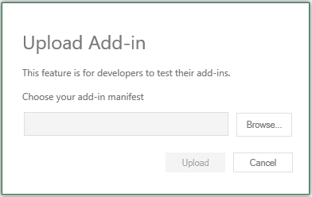

# Save custom settings in your Office Add-in

This sample shows how to save custom settings inside an Office Add-in. The add-in stores data as key/value pairs, using the JavaScript API for Office property bag, browser cookies, web storage (**localStorage** and **sessionStorage**), or by storing the data in a hidden div in the document.

## Applies to

- Excel, Word, and PowerPoint on Windows, Mac, and in a browser.

## Prerequisites

- Microsoft 365 - Get a [free developer sandbox](https://developer.microsoft.com/microsoft-365/dev-program#Subscription) that provides a renewable 90-day Microsoft 365 E5 developer subscription.

## Run the sample

You can run this sample in Excel, Word, or PowerPoint in a browser. The add-in web files are served from this repo on GitHub.

1. Download the **manifest.xml** file from this sample to a folder on your computer.
1. Open [Office on the web](https://office.live.com/).
1. Choose **Excel**, **Word**, or **PowerPoint**, and then open a new document.
1. Open the **Insert** tab on the ribbon and choose **Add-ins** (**Office Add-ins** for Excel).
1. In the **Office Add-ins** dialog, select the **MY ADD-INS** tab, choose **Manage My Add-ins**, and then **Upload My Add-in**.
   
1. Browse to the add-in manifest file, and then select **Upload**.
   
1. Verify the add-in loaded successfully. You'll see a **Custom settings** button on the **Home** tab on the ribbon.

## Run the sample on Office on Windows or Mac

Office Add-ins are cross-platform so you can also run them on Windows, Mac, and iPad. The following links will take you to documentation for how to sideload on Windows, Mac, or iPad. Be sure you have a local copy of the manifest.xml file for the custom settings sample. Then follow the sideloading instructions for your platform.

- [Sideload Office Add-ins for testing from a network share](https://learn.microsoft.com/office/dev/add-ins/testing/create-a-network-shared-folder-catalog-for-task-pane-and-content-add-ins)
- [Sideload Office Add-ins on Mac for testing](https://learn.microsoft.com/office/dev/add-ins/testing/sideload-an-office-add-in-on-mac)
- [Sideload Office Add-ins on iPad for testing](https://learn.microsoft.com/office/dev/add-ins/testing/sideload-an-office-add-in-on-ipad)

## Configure a localhost web server and run the sample from localhost

If you prefer to configure a web server and host the add-in's web files from your computer, use the following steps.

1. Install a recent version of [npm](https://www.npmjs.com/get-npm) and [Node.js](https://nodejs.org/) on your computer. To verify if these tools are already installed on your computer, run the commands `node -v` and `npm -v` in your terminal.

1. You need http-server to run the local web server. If you haven't installed this yet, use the following command to install it.

    ```console
    npm install --global http-server
    ```

1. You need Office-Addin-dev-certs to generate self-signed certificates to run the local web server. If you haven't installed this yet, use the following command.

    ```console
    npm install --global office-addin-dev-certs
    ```

1. Clone or download this sample to a folder on your computer. Then go to that folder in a console or terminal window.
1. Run the following command to generate a self-signed certificate that you can use for the web server.

    ```console
    npx office-addin-dev-certs install
    ```

    The previous command will display the folder location where it generated the certificate files.

1. Go to the folder location where the certificate files were generated. Copy the localhost.crt and localhost.key files to your cloned or downloaded sample folder.

1. Run the following command.

    ```console
    http-server -S -C localhost.crt -K localhost.key --cors . -p 3000
    ```

    The http-server will run and host the current folder's files on localhost:3000.

Now that your localhost web server is running, sideload the **manifest-localhost.xml** file provided in the office-add-in-save-custom-settings folder. Using the **manifest-localhost.xml** file, follow the steps in [Run the sample](#run-the-sample) to sideload and run the add-in.

## Use the sample in your own project

To reuse the code from this sample you'll want to look at the specific functions that save or get settings in the **taskpane.js** file. For example, the **saveToPropertyBag** and **getFromPropertyBag** files work with the Office settings object to access settings in the property bag. Decide which storage method you want to use. Then copy the corresponding methods for that storage method to your own project. The methods are self-contained and can be called directly from your code.

If you're using the property bag and also want to save the settings into the Excel, Word, or PowerPoint document, you'll need to include the following code. Modify the error handling function as needed for your own project.

```javascript
Office.context.document.settings.saveAsync(function (asyncResult) {
    if (asyncResult.status == Office.AsyncResultStatus.Failed) {
        console.log('Settings save failed. Error: ' + asyncResult.error.message);
    } else {
        console.log('Settings saved.');
    }
});
```

## Additional resources

- [Persist add-in state and settings](https://learn.microsoft.com/office/dev/add-ins/develop/persisting-add-in-state-and-settings)
- [Introduction to Web Storage](http://msdn.microsoft.com/library/cc197062(VS.85).aspx)
- [Settings object](https://learn.microsoft.com/javascript/api/office/office.settings)

## Questions and feedback

- Did you experience any problems with the sample? [Create an issue](https://github.com/OfficeDev/Office-Add-in-samples/issues/new/choose) and we'll help you out.
- We'd love to get your feedback about this sample. Go to our [Office samples survey](https://aka.ms/OfficeSamplesSurvey) to give feedback and suggest improvements.
- For general questions about developing Office Add-ins, go to [Microsoft Q&A](https://learn.microsoft.com/answers/topics/office-js-dev.html) using the office-js-dev tag.

## Copyright

Copyright (c) 2022 Microsoft Corporation. All rights reserved.

This project has adopted the [Microsoft Open Source Code of Conduct](https://opensource.microsoft.com/codeofconduct/). For more information, see the [Code of Conduct FAQ](https://opensource.microsoft.com/codeofconduct/faq/) or contact [opencode@microsoft.com](mailto:opencode@microsoft.com) with any additional questions or comments.

