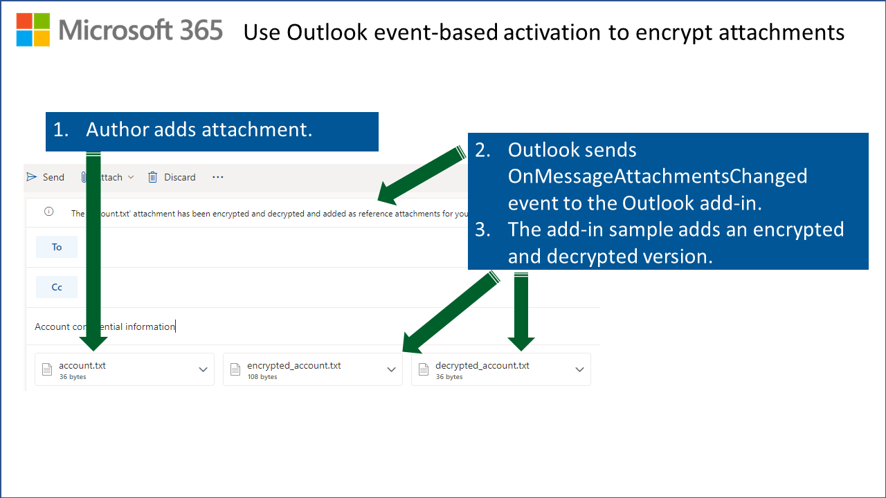
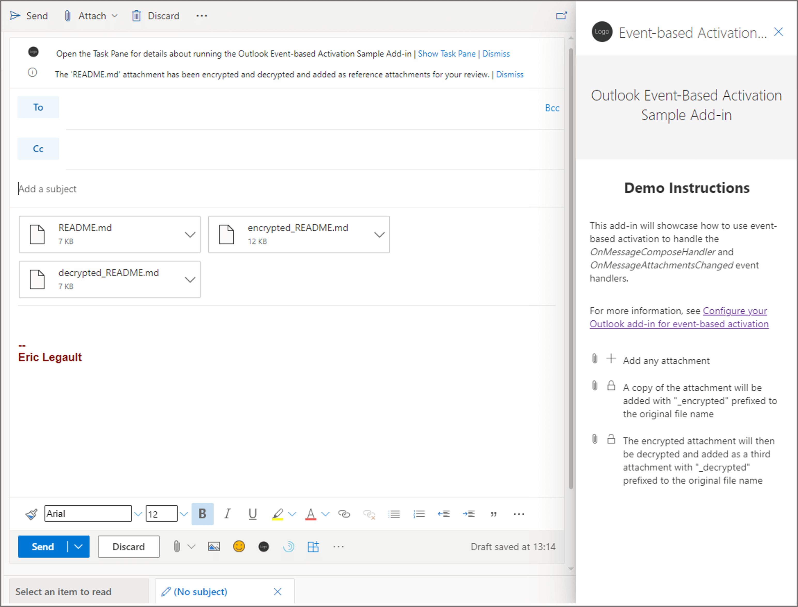

# Use Outlook event-based activation to encrypt attachments, process meeting request attendees and react to appointment date/time changes

**Applies to**: Outlook on Windows | Outlook on the web



## Summary

---

This sample showcases how to use event-based activation in an Outlook add-in when the user composes an email or appointment/meeting request.  It demonstrates how to run tasks based on events that fire when certain data changes when the user:

- adds an attachment to an email or appointment/meeting request
- adds recipients or distributions lists as required or optional attendeees in a meeting request
- changes the start or end date or time in an appointment/meeting request
- adds a notification message to the item when a new email or appointment/meeting request is created, instructing the user to open the task pane for further information.

## Features/Scenario

- **Encryption based on attachment change events.** This sample encrypts the first attachment that is added to a composed email or appointment, and adds it as another attachment with an "encrypted_" prefix on the file name. It then decrypts that attachment and adds it as another attachment with a "decrypted_" prefix on the file name.
  - Also adds a notification message to the compose item to denote that encryption and decryption is in progress. When completed, that message is removed (it may only appear for a very brief time, depending on the complexity of the encryption process) and another notification message is added noting that the process has completed:   
- **Notifications based on recipient changes.** This sample adds notification messages to a meeting request when recipients are added or removed. The notification message are removed when there are no longer any recipients.
  - Shows a message with a running tally of the number of required and optional attendees.
  - Show a message with a warning if one or more distribution lists are invited as an attendee
- **Notifications based on date/time changes.** This sample adds a notification message to an appointment when the user changes the date/time, showing the original date/time that was set when the appointment was opened. The notification message provides a reference for further date/time edits.   

## Applies to

---

- Outlook
  - Windows
  - web browser

## Prerequisites

---

- Microsoft 365

> Note: If you don't have a Microsoft 365 subscription, you can get a [free developer sandbox](https://developer.microsoft.com/microsoft-365/dev-program#Subscription) that provides a renewable 90-day Microsoft 365 E5 subscription for development purposes.

## Solution

---

| Solution | Author(s) |
| ---- | ---- |
| Use Outlook event-based activation to process item attachments, meeting request recipients, and appointment date/time changes. | [Eric Legault](https://twitter.com/elegault) |

## Version history

---

| Version | Date       | Comments        |
| ------- | ---------- | --------------- |
| 1.0     | 10-14-2021 | Initial release |

## Run the sample

---

Run this sample in Outlook on Windows or in a browser. The add-in web files are served from this repo on GitHub.

1. Download the **manifest.xml** file from this sample to a folder on your computer.
1. Sideload the add-in manifest in Outlook on the web or on Windows by following the manual instructions in the article [Sideload Outlook add-ins for testing](https://docs.microsoft.com/office/dev/add-ins/outlook/sideload-outlook-add-ins-for-testing).

### Try it out

Once the add-in is loaded, use the following steps to try out the functionality.

#### Manage attachments

1. Create a new message or appointment.
    >A notification appears at the top of the message that reads **Open the task pane for details about running the Outlook event-based activation sample add-in**. | Open task pane | Dismiss
1. Add an attachment.
    > A notification appears at the top of the message that reads **The '{file name} attachment has been encrypted and decrypted and added as reference attachments for your review**. | Dismiss

#### Set up meetings

1. Create a new meeting request. In Outlook on the web, choose **More options** to expand the request and include all details. Otherwise, you won't see the notifications in the next steps.
1. Add a user as a required or optional attendee.
    > A notification appears at the top of the message that reads **Your appointment has 1 required and 0 optional attendees**. | Dismiss
1. Add a distribution list as a required or optional attendee.
    > A notification appears at the top of the message that reads **Warning! Your appointment has a distribution list! Make sure you have chosen the correct one!** | Dismiss
1. Change the start or end date or time.
    > A notification appears at the top of the message that reads **Original date/time: Start = ##/##/#### #:##:## ##; End = ##/##/#### #:##:## ##**. | Dismiss

## Run the sample from localhost

If you prefer to host the web server for the sample on your computer, follow these steps.

1. Install a recent version of [npm](https://www.npmjs.com/get-npm) and [Node.js](https://nodejs.org/) on your computer. To verify if you've already installed these tools, run the commands `node -v` and `npm -v` in your terminal.
1. You need http-server to run the local web server. If you haven't installed this yet, run the following command.

    ```console
    npm install --global http-server
    ```

1. Use a tool such as openssl to generate a self-signed certificate that you can use for the web server. Move the cert.pem and key.pem files to the root folder for this sample.
1. From a command prompt, go to the root folder and run the following command.

    ```console
    http-server -S --cors . -p 3000
    ```

1. To reroute to localhost, run office-addin-https-reverse-proxy. If you haven't installed this, run the following command.

    ```console
    npm install --global office-addin-https-reverse-proxy 
    ```

    To reroute, run the following in another command prompt.

    ```console
    office-addin-https-reverse-proxy --url http://localhost:3000 
    ```

1. Sideload `manifest.xml` in Outlook on the web or on Windows by following the manual instructions in the article [Sideload Outlook add-ins for testing](https://docs.microsoft.com/office/dev/add-ins/outlook/sideload-outlook-add-ins-for-testing).
1. [Try out the sample!](#try-it-out)

## Key parts of this sample

### Configure event-based activation in the manifest

The manifest configures a runtime that loads a single JavaScript file to handle event-based activation. The following `<Runtime>` element specifies a `commands.html` page resource id that loads the `commands.js` file on Outlook on the web. The `<Override>` element directly specifies the `commands.js` JavaScript file to load when running on Outlook on Windows. Outlook on Windows doesn't use the HTML page to load the JavaScript file.

```xml
<Runtime resid="WebViewRuntime.Url">
  <Override type="javascript" resid="JSRuntime.Url"/>
...
<bt:Url id="WebViewRuntime.Url" DefaultValue="https://officedev.github.io/Office-Add-in-samples/Samples/outlook-encrypt-attachments/src/commands/commands.html" />
<bt:Url id="JSRuntime.Url" DefaultValue="https://officedev.github.io/Office-Add-in-samples/Samples/outlook-encrypt-attachments/src/commands/commands.js" />
```

The add-in handles six events that are mapped to various functions.

```xml
<LaunchEvents>
  <LaunchEvent Type="OnNewMessageCompose" FunctionName="onMessageComposeHandler" /> 
  <LaunchEvent Type="OnNewAppointmentOrganizer" FunctionName="onAppointmentComposeHandler" />                 
  <LaunchEvent Type="OnAppointmentAttendeesChanged" FunctionName="onAppointmentAttendeesChangedHandler" />
  <LaunchEvent Type="OnAppointmentTimeChanged" FunctionName="onAppointmentTimeChangedHandler" /> 
  <LaunchEvent Type="OnMessageAttachmentsChanged" FunctionName="onMessageAttachmentsChangedHandler" /> 
  <LaunchEvent Type="OnAppointmentAttachmentsChanged" FunctionName="onAppointmentAttachmentsChangedHandler" />
</LaunchEvents>
```

### Handle events

When the user creates a new message or appointment, Outlook loads the `commands.js` file specified in the manifest to handle the following events.

| Event | Handler |
| --- | ---|
| `OnNewMessageCompose` | onMessageComposeHandler |
| `OnNewAppointmentOrganizer` | onAppointmentComposeHandler |
| `OnAppointmentAttendeesChanged` | onAppointmentAttendeesChangedHandler |
| `OnAppointmentTimeChanged` | onAppointmentTimeChangedHandler |
| `OnMessageAttachmentsChanged` | *onItemAttachmentsChangedHandler |
| `OnAppointmentAttachmentsChanged` | *onItemAttachmentsChangedHandler |

> [!NOTE]
> The onItemAttachmentsChangedHandler function handles both OnMessageAttachmentsChanged and OnAppointmentAttachmentsChanged.

Outlook on the web loads the `commands.html` page, which then also loads `commands.js`.

### Task pane code

The task pane code is located under the `taskpane` folder of this project. The task pane HTML and JavaScript files only provide a UI with details about this sample.

- `taskpane_appt_compose.html` is loaded when the user chooses the **Open task pane** link in the notification message or chooses **Show task pane** in the ribbon.
- `taskpane_msg_compose.html` is loaded when the user chooses the **Open task pane** link in the notification message or chooses **Show task pane** in the ribbon.

## Known Issues

- At present, imports are not supported in the JavaScript file where you implement the handling for event-based activation. This means that external libraries (like the `crypto-js` library used in this sample) cannot be required directly in the `commands.js` file and must be loaded in `commands.html`. Since Outlook on Windows only loads `commands.js`, the `crypto-js` library cannot be loaded to perform the encryption of attachments. Only Outlook on the web can load supporting .html files with external library references. Therefore encryption is only implemented for that scenario.
- `console.dir()` methods cannot be used in event-based activation code on Outlook on Windows.
- `window.localStorage` cannot be used in event-based activation code on Outlook on Windows.
- Choosing the **Open task pane** link in the InfoBar may not work in Outlook on the web. A fix has been deployed. For more information, see [Can't open task pane from link in Outlook NotificationMessages](https://github.com/OfficeDev/office-js/issues/2125) issue on GitHub.

## References

- [Configure your Outlook add-in for event-based activation](https://learn.microsoft.com/office/dev/add-ins/outlook/autolaunch)
- [Debug your event-based Outlook add-in](https://learn.microsoft.com/office/dev/add-ins/outlook/debug-autolaunch)
- Other samples:
  - [Use Outlook event-based activation to set the signature](https://github.com/OfficeDev/PnP-OfficeAddins/tree/main/Samples/outlook-set-signature)
  - [Use Outlook event-based activation to tag external recipients](https://github.com/OfficeDev/PnP-OfficeAddins/tree/main/Samples/outlook-tag-external)
- [crypto-js](https://www.npmjs.com/package/crypto-js)
- [Office.SessionData interface](https://learn.microsoft.com/javascript/api/outlook/office.sessiondata)
- [Microsoft Office Add-in Debugger Extension for Visual Studio Code](https://learn.microsoft.com/office/dev/add-ins/testing/debug-with-vs-extension)
- [Develop Office Add-ins with Visual Studio Code](https://learn.microsoft.com/office/dev/add-ins/develop/develop-add-ins-vscode)
- [Office Add-ins with Visual Studio Code](https://code.visualstudio.com/docs/other/office)
- [Debugging with Visual Studio Code](https://code.visualstudio.com/docs/editor/debugging)
- [Node.js debugging in VS Code](https://code.visualstudio.com/docs/nodejs/nodejs-debugging)
- [Office-Addin-Debugging](https://www.npmjs.com/package/office-addin-debugging)
- [Getting recipients and attendees Script Lab sample](https://raw.githubusercontent.com/OfficeDev/office-js-snippets/prod/samples/outlook/30-recipients-and-attendees/get-set-required-attendees-appointment-organizer.yaml)

## Copyright

Copyright (c) 2021 Microsoft Corporation. All rights reserved.

This project has adopted the [Microsoft Open Source Code of Conduct](https://opensource.microsoft.com/codeofconduct/). For more information, see the [Code of Conduct FAQ](https://opensource.microsoft.com/codeofconduct/faq/) or contact [opencode@microsoft.com](mailto:opencode@microsoft.com) with any additional questions or comments.

---


